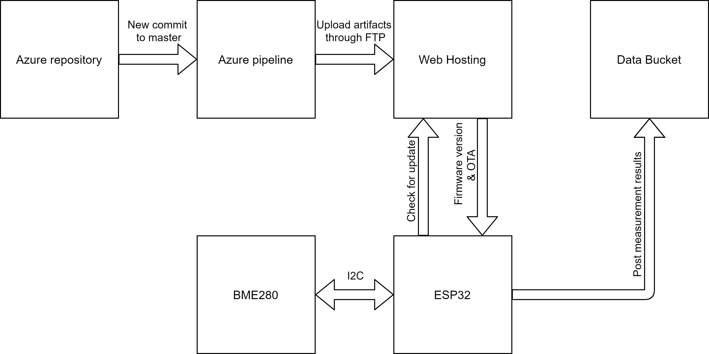
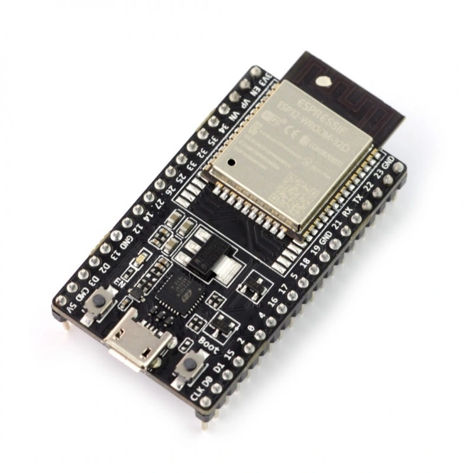
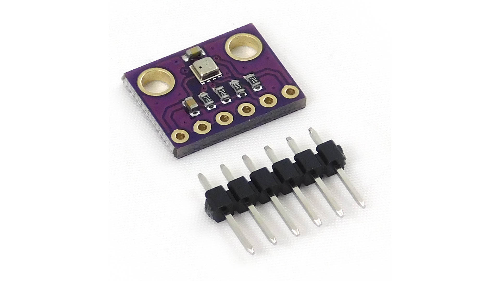

# ESP32 Measurement Station

Z racji utraty dostępu do uczelnianego konta Azure, dodaję tu kopię repozytorium projektu.

Link do raportu: [Raport](docs/ESP32_Measurement_Station___Documentation.pdf)
---

## Autorzy

- Jan Wołowiec
- Szymon Głogowski

---

## Wprowadzenie
Projekt przewiduje wykorzystanie układu ESP32 korzystającego z czujników podłączonych magistralą I2C. 
W przypadku tego projektu wykorzystany został moduł BME280 realizujący pomiary ciśnienia, temperatury i wilgotności.

Dodatkową funkcjonalnością systemu jest wykorzystanie aktualizacji OTA, sprzężonej z pipeline'em Azure DevOps, celem ograniczenia potrzeby ingerencji w sprzęt i ułatwienia procesu aktualizacji.

---

## Bloki funkcjonalne systemu
Na załączonym diagramie został przedstawiony sposób interakcji poszczególnych bloków ze sobą. Opis poszczególnych bloków znajduje się poniżej.

### ESP32-WROOM-32D
Układ SoC oferujący możliwość komunikacji m.in. po WiFi oraz Bluetooth.

### BME280
Sensor firmy Bosch realizujący pomiary ciśnienia, temperatury i wilgotności. Wykorzystuje on do komunikacji z układem ESP32 magistralę I2C.

### Azure repository
Repozytorium **GIT** znajdujące się na platformie **Azure DevOps**. Wszelkie wprowadzanie zmian powinno być realizowane na prywantych branch'ach, 
po czym merge powinien być wykonany z wykorzystaniem mechanizmu **Pull Request**(dalej zwanym **PR**). 

Warunkami akceptacji PR są:
- Podlinkowanie taska związaniego z danym PR
- Rozwiązanie wszystkich komentarzy
- Sukcesywne wykonanie się pipeline walidacyjnego (PR_ESP32), celem wykrycia potencjanych błędów w kodzie

Dodatkowo celem utrzymania porządku na branchu main, możliwe typy merge zostały ograniczone do typu squash.

### Azure pipeline
Na platformie Azure DevOps zostały utworzone 2 pipeline'y:
- PR_ESP32
- CI_ESP32

Pipeline z przedrostkiem PR wykorzystywany jest do walidacji Pull Requestów przed mergowaniem ich do branch'a **main**.
Z kolei pipeline z przedrostkiem CI aktywowany jest przy każdych zmianach wprowadzanych do brancha **main**, celem wygenerowania pliku binarnego służącego do zaprogramowania układu.

Kroki wykonywane kolejno przez pipeline'y to:
1. Instalacja narzędzia Docker CLI
2. Uruchomienie obrazu Docker'a espressif/idf i wykonanie build'a ze specyfikowanymi parametrami takimi jak: *wifi ssid*, *wifi pass*, *build version*
3. Przygotowanie wygenerowanych artefaktów, przeniesienie ich do odpowiedniego folderu oraz generacja pliku z wersją build'u
4. Opublikowanie artefaktów w systemie Azure Pipelines
5. Jako dodatkowy krok pipeline'u CI_ESP32 wykonywane jest przesłanie artefaktów na hosting internetowy przechowujący dane do wykonania aktualizacji OTA za pomocą FTP

Zmienne wykorzystowane w trakcie uruchamiania pipeline'ów:
- *wifi ssid* - ssid sieci do której będzie się łączył układ ESP - **secret**
- *wifi pass* - hasło sieci do której będzie się łączył układ ESP - **secret**
- *ftp url* - link do serwera FTP
- *ftp user* - nazwa użytkownika w serwerze FTP - **secret**
- *ftp pass* - hasło użytkownika w serwerze FTP - **secret**
- *build version* - wartość dostarczana przez sam pipeline pod zmienną *$(Build.BuildId)*

### Web Hosting
Hosting HTTPS przechowujący wersję najnowszego buildu oraz binarny plik aktualizacji OTA, 
pozwoli to na weryfikację przez układ ESP czy jego wewnętrzna wersja oprogramowania jest równa tej przechowywanej na serwerze.
Jeśli zostanie wykryta nowsza wersja, nastąpi pobranie pliku binarnego OTA oraz zostanie przeprowadzna aktualizacja.

Dodatkową opcją do rozważenia jest wykonanie własnej strony i bazy danych przechowującej pliki dostarczane z czujników, z racji że hosting będzie tak czy inaczej wymagany do działania funkcjonalności autoaktualizacji.

### Data Bucket
Serwer zbierający otrzymywane dane oraz pozwalający na ich wizualizację, początkowym założeniem jest wykorzystanie gotowych platform typu **thinger.io** lub **thingspeak.com**, 
które posiadają web api pozwalające na przesyłanie do nich danych za pomocą requestów HTTP typu POST. 
Jak zostało wspomniane w poprzednim punkcie opcjonalnym rozwiązaniem jest próba samodzielnej implementacji takiego rozwiązania.

---

## Wykorzystane oprogramowanie
- GIT
- [ESP-IDF](https://docs.espressif.com/projects/esp-idf/en/latest/esp32/get-started/)
- Visual Studio Code
- Docker
- WinScp

---

## Główne etapy projektu
Zadania nazywane również *taskami* będą dodawane bezpośrednio w systemie Azure DevOps, natomiast poniżej zostały wylistowane ważniejsze etapy projektu:
- [x] Zapoznanie się z wykorzystywanymi technologiami
- [x] Rozpisanie tasków
- [x] Konfiguracja projektu w środowisku Azure
- [x] Konfiguracja pipeline'ów
- [x] Konfiguracja web hostingu
- [x] Konfiguracja platformy do wizualizacji danych
- [x] Implementacja obsługi układu BME280
- [x] Implementacja funkcjonalności OTA over HTTPS
- [x] Implementacja wysyłania przetworzonych danych requestami HTTP typu POST
- [x] Weryfikacja zaimplementowanych funkcjonalności.
- [x] Opcjonalne stworzenie własnej platformy do wizualizacji danych
